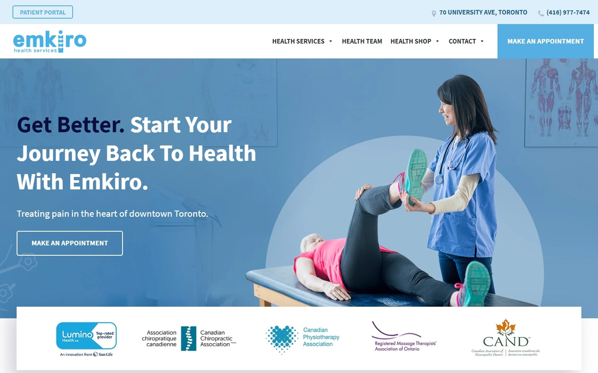

# 🌟 Brajesh Kumar's Portfolio 🌟  
**Machine Learning Engineer | AI Enthusiast** 
---

## 📞 Contact & Links  
-  📧 Email: [brajesh350194@gmail.com](mailto:brajesh350194@gmail.com)  
-  💼 LinkedIn: [brajesh-gupta](https://linkedin.com/in/brajesh-gupta)  
-  🐙 GitHub: [@LazyCoderForU](https://github.com/LazyCoderForU)  
-  📱 Mobile: +91-7979911811  

---

## 🌐 Welcome  

Welcome to my **Personal Portfolio Website**, a space to showcase my skills, projects, and professional journey in **Machine Learning**, **Data Science**, and AI-powered solutions. 
Deployed and live via **GitHub Pages** using the `jekyll-theme-minimal` theme!  

---

## 📌 About Me  

I’m a **prefinal year B.Tech Computer Science student** at Lovely Professional University, specializing in **Machine Learning**. I’m passionate about building AI-powered solutions that make everyday life smarter and simpler.

My main interests lie in **Natural Language Processing** and **Data Science** — turning complex data into meaningful, actionable insights.  

---

## 🛠️ Tech Stack  

|  |  |  |  |  
|:----------------:|:--------------:|:-------------:|:----------------:|
| Python | C | Java | Docker |

|  |  |  |  |
|:----------------:|:--------------:|:--------------:|:------------------:|
| TensorFlow | NumPy | Pandas | scikit-learn |

|  |  |  |  |
|:---------------:|:----------------:|:----------------:|:------------------:|
| Git | GitHub | Jupyter | Anaconda |

|  |  |  |
|:-----------------:|:-----------------:|:----------------------:|
| Google Colab | Notion | C++ |

---

## 📂 Project Highlights  

- 📊 **Medicoz:**  
    
  An AI-driven health management platform that provides personalized health insights and recommendations.  
  [GitHub Repository](https://github.com/yourusername/medicoz)

- 📝 **NER with CRF:**  
    
  A Natural Language Processing project using Conditional Random Fields for Named Entity Recognition.  
  [GitHub Repository](https://github.com/yourusername/ner-with-crf)

- 😷 **Real-time Face Mask Detection:**  
    
  A computer vision system that detects face masks in real-time using deep learning.  
  [GitHub Repository](https://github.com/yourusername/face_mask-detection)

- 🌍 **Earthquake Prediction System:**  
    
  A machine learning model to predict earthquakes based on seismic data.  
  [GitHub Repository](https://github.com/yourusername/earthquake-prediction)

---

## 🚀 Career Vision  

I aspire to lead **AI-driven software development teams**, creating products that improve everyday lives through innovation and real-world impact.

---

## 📜 Certificates & Achievements  

- **Deep Learning Specialization (Coursera)**  
- **Smart India Hackathon 2024 Finalist**  
- **Typing Speed: 100 WPM**

---
